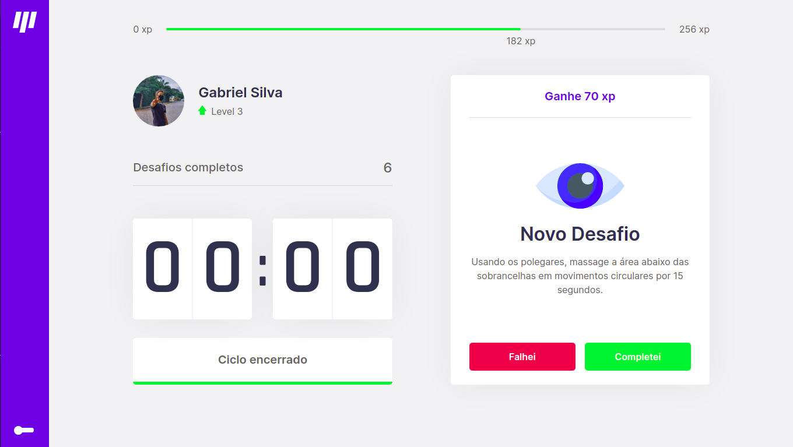

# Move it

## Estude e trabalhe de maneira organizada com a técnica Pomodoro no Move it!

### Você já pode testar se quiser! Só clicar nesse link: [move-it](https://move-it-dun.vercel.app/)

<hr>

### Veja como é:

<p align="center">
  
</p>
<p align="center">
  
</p>
<p align="center">
  
</p>

<!-- ### Também em Dark Mode

<p align="center">
  
</p>
 -->
<hr>

### Mobile (**Em breve**)

<!-- <p align="center" >
  
  _______
  
</p> -->

<hr>

## Como executar na sua máquina e testar

<br>

### **Instalando e executando o projeto**

<br>

No terminal digite todos os comandos abaixo:

```Bash
git clone https://github.com/devzgabriel/move-it.git
```

```Bash
cd move-it
```

```Bash
yarn install
```

```Bash
yarn start
```

### **Executando testes**

Os testes serão acrescentados em breve!

<hr>

## **Criado por Gabriel Silva ministrada pela Rocketseat**
